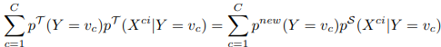
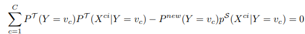
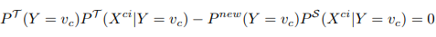
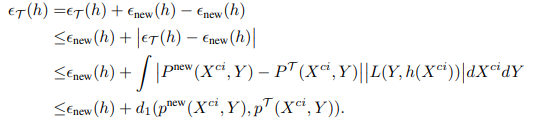

# 具有条件可迁移成分的域适应

## 引用方式

### GB/T 7714

Gong M, Zhang K, Liu T, et al. Domain adaptation with conditional transferable components[C]//International conference on machine learning. PMLR, 2016: 2839-2848.

### Bibtex

    @inproceedings{gong2016domain,
      title={Domain adaptation with conditional transferable components},
      author={Gong, Mingming and Zhang, Kun and Liu, Tongliang and Tao, Dacheng and Glymour, Clark and Sch{\"o}lkopf, Bernhard},
      booktitle={International conference on machine learning},
      pages={2839--2848},
      year={2016},
      organization={PMLR}
    }

## 主要思想

当训练（源域）和测试（目标域）数据具有不同的分布时，在监督学习中会出现域自适应。假设 $X$ 和 $Y$ 分别表示特征和目标，先前关于域自适应的工作主要考虑协变移位情况，其中特征 $P(X)$ 的分布在域之间变化，而条件分布 $P(Y|X)$ 保持不变。为了减少域差异，最近的方法试图通过显式地最小化分布差异度量来找到在不同域上具有相似 $P(\mathcal{T}(X))$ 的不变成分 $\mathcal{T}$ 。然而，尚不清楚当 $P(Y|X)$ 改变时，不同域中的 $P(Y|\mathcal{T}(X))$ 是否也相似。此外，可迁移成分不一定必须是不变的。如果某些成分的变化是可识别的，可以利用这些成分在目标域中进行预测。在本文中，关注 $P(X|Y)$ 和 $P(Y)$ 在因果系统中都发生变化的情况，其中 $Y$ 是 $X$ 的原因。在适当的假设下，本文旨在提取条件分布 $P(\mathcal{T}(X)|Y)$ 在适当的位置尺度（LS）变换后不变的条件可迁移成分，并识别 $P(X)$ 如何在域之间同时变化。本文对合成数据和真实数据进行了理论分析和实证评估，以证明方法的有效性。

## 主要内容

### 引言

DA：源域与目标域数据分布不同。例如目标检测的问题中不同数据集的图像使用不同的相机或在不同的成像条件（例如，姿势和照明）下拍摄。

DA方法旨在通过在领域之间传递知识来解决这类问题。

#### 协变量移位

许多现有的DA方法考虑协变量移位情况，其中两个域上的分布仅在特征 $P(X)$ 的边缘分布上不同，而给定目标特征的条件分布 $P(Y|X)$ 不变。

在这种情况下，如果源域比目标域丰富，则可以通过重要性重新加权方法来匹配源域和目标域上的特征分布 $P(X)$ 。<a href="zotero://open-pdf/library/items/Y9Q75CLZ?page=8">“Transferring the Knowledge of Instances”</a> (<a href="zotero://select/library/items/CQHCXPPZ">Pan 和 Yang, 2010, p. 8</a>) 权重被定义为源域特征和目标域特征之间的密度比，并且可以通过诸如KMM之类的各种方法来有效地估计。

#### 不变成分型方法

许多soat方法试图通过找到跨域的不变表示或成分来减少域偏移。

这些不变成分(IC)型方法假设存在一个变换 $\mathcal{T}$ ，使得 $P^S(\mathcal{T}(X)) \approx P^{T}(\mathcal{T}(X))$ ，其中 $P^S,P^T$ 分别表示源域分布和目标域分布。

因为在无监督域DA场景中，目标域中没有标签，所以不能通过最小化 $P^S(Y|\mathcal{T}(X))$ 和 $P^T(Y|\mathcal{T}(X))$ 之间的距离来学习 $\mathcal{T}$ 。因此，这些方法简单地假设通过匹配变换特征的分布而学习的变换 $\mathcal{T}$ 满足 $P^S(Y|\mathcal{T}(X)) \approx P^{T}(Y|\mathcal{T}(X))$ 。

此外，域之间可迁移的成分不一定是不变的。如果从源域上的经验联合分布和目标域上特征的经验边缘分布可以识别出某些成分的变化，可以利用这些成分进行域自适应。

#### 因果模型

为了在域之间成功地迁移知识，需要捕获潜在的因果机制或数据生成过程。为此，使用因果模型来描述域之间的分布如何变化，从而解决了域适应问题。

$C$ ：因； $E$ ：果； $P(C)$ ：产生原因的过程； $P(E|C)$ ：将原因转化为结果的机制。因果系统 $C\rightarrow E$ 的一个重要特征是机制 $P(E|C)$ 独立于原因生成过程 $P(C)$ 。

例如，在因果系统 $X\rightarrow Y$ 中，如果 $P(Y|X)$ 跨域变化，则很难纠正 $P(Y|X)$ ，除非它被特定的变换（如随机翻转标签）改变，因为 $P(X)$ 没有关于 $P(Y|X)$ 的任何信息。

#### 广义目标偏移

本文中旨在找到广义目标转移（GeTarS）场景中的条件不变或可迁移成分，其中因果方向为 $Y\rightarrow X$ 。在这种情况下， $P(Y)$ 和 $P(X|Y)$ 彼此独立变化，而 $P(X)$ 和 $P(Y|X)$ 彼此不独立变化，因此可以从标记的源域数据和未标记的目标域数据校正 $P(Y|X)$ 。

GeTarS方法假设所有特征都可以通过位置尺度(LS)变换迁移到目标域。然而，在LS变换之后，许多特征可能会非常嘈杂或无法很好地匹配，这使得GeTarS在实践中受到限制。

本文在适当的假设下，目标是找到其条件分布在域之间不变的成分，即 $P^S(\mathcal{T}(X)|Y)\approx P^T(\mathcal{T}(X)|Y)$ ，并从标记的源域和未标记的目标域估计目标域标签分布 $P^T(Y)$ 。通过这种方式，可以通过使用条件不变分量和重新加权源域数据来校正 $P(Y|X)$ 中的偏移。类似地，能够找到经过适当的LS变换后条件分布不变的可迁移分量。

### 符号定义

\
(<a href="zotero://select/library/items/BQ9ZK9MI">Gong 等, p. 2</a>)

### 条件可迁移成分

条件不变成分(CIC)： $X^{ci}$ 为满足 $P(X^{ci}|Y)$ 在不同域上保持不变的条件的成分。

由于位置尺度(LS)变换经常发生在给定标签的特征的条件分布中，所以提出了：

条件可迁移方法(CTC)：对于每个 $Y$ 值，给定 $Y,P(X^{ct}|Y)$ ，提取的条件可迁移成分 $X^{ct}$ 的条件分布仅在位置和比例上不同（所有域内）。

\
(<a href="zotero://select/library/items/BQ9ZK9MI">Gong 等, p. 3</a>)

左图：CIC；右图：CTC。

$domain$ ：特定于域所选择变量。

$X^{ci}$ ： $X$ 的成分，其条件分布 $P(X^{ci}|Y)$ 是域不变的。本文假设 $X^{ci}$ 可以从 $X$ 还原为 $\mathcal{T}(X)$ 。

$X^{\perp}$ ： $X$ 的其余成分。它可能依赖于给定域的 $Y$ ，在估计 $X^{ci}$ 时，希望这种依赖性尽可能弱，以便 $X^{ci}$ 包含尽可能多的关于 $Y$ 的信息。

CTC中，对于每个 $Y$ 值， $P(X^{ct}|Y)$ 仅在不同域之间的位置和比例上不同。

#### 条件不变成分

首先假设存在可以表示为 $D$ 维原始特征的线性变换的 $d$ 维条件不变分量，即 $X^{ci}＝W^\top X$ ，其中 $W\in\mathbb{R}^{D\times d},X\in\mathbb{R}^D$ 。

为确保 $X^{ci}$ 的维度上无冗余信息，将 $W$ 的列约束为正交： $W^\top W=I_d$ 。

如果有两个 $X$ 和 $Y$ 都已知的域，可直接执行条件： $P^T(X^{ci}|Y)=P^S(X^{ci}|Y)$ 。

在无监督DA中，无法访问目标域上的 $Y$ 值，因此不能直接匹配条件分布，此时只有 $X$ 的经验边际分布在测试域上可用。

在温和条件下，匹配条件分布 $P^T(X^{ci}|Y)=P^S(X^{ci}|Y)$ 可以通过匹配边缘分布 $P^T(X^{ci})$ 来实现，该边缘分布等于 $\int P^T(X^{ci}|y)P^T(y)dy$ ， $X$ 的构造边缘分布对应于 $P^S(X^{ci}|Y)$ 和 $P^{new}(Y)$ ：

\
(<a href="zotero://select/library/items/BQ9ZK9MI">Gong 等, p. 3</a>)

**定义1**： 如果 $P(\mathcal{T}(X)|Y=v_c),c=1,\dots,C$ 是线性相关的，变换 $\mathcal{T}(X)$ 被称为平凡变换。

通过平凡变换，变换后的成分 $\mathcal{T}(X)$ 失去了预测目标 $Y$ 的一些能力。例如，考虑一个只有两个类的分类问题。对于平凡变换， $P(\mathcal{T}(X)|Y=v_c),c=1,2$ 是相同的，因此， $\mathcal{T}(X)$ 对于分类是无用的。

**定理1：** 假设线性变换 $W$ 是非平凡的。进一步假设， $A^{CIC}$ ：对 $\forall \kappa_{c 1}, \kappa_{c 2}(\kappa_{c 1}^2+\kappa_{c 2}^2 \neq 0)$ 集合中的元素 $\{\kappa_{c1} P^S(W^\top X|Y=v_c)+\kappa_{c2}P^T(W^\top X|Y=v_c),c=1,\dots,C\}$ 是线性独立的（如果它们不为零）。如果 $P^{new}(X^{ci})=P^T(X^{ci})$ 成立，有 $P^S(X^{ci}|Y)=P^T(X^{ci}|Y)$\[跨域不变的条件分布]和 $P^{new}(Y)=P^T(Y)$ \[估计目标域标签分布]，即 $X^{ci}$ 是从源到目标域的条件不变成分。

**证明：** 结合 $P^{n e w}(X^{c i})=\int P^{\mathcal{S}}(X^{c i} \mid y) P^{n e w}(y) d y$ 以及 $P^{new}(X^{ci})=P^T(X^{ci})$ ，有：

如果变换 $W$ 是非平凡的，则不存在非零的 $\gamma_1,\dots,\gamma_C$ 和 $\nu_1,\dots,\nu_C$ ，使得 $\sum_{c=1}^C\gamma_cP^T(X^{ci}|Y=v_c)=0$ 和 $\sum_{c=1}^C\nu_cP^S(X^{ci}|Y=v_c)=0$ 。因此，可将上图中式子转化为：

根据 $A^{CIC}$ ，对 $\forall c$ 有：

取上式积分可得 $P^{new}(Y=v_c)=P^T(Y=v_c)$ ，更表明 $P^S(X^{ci}|Y=v_c)=P^T(X^{ci}|Y=v_c)$ 。

证毕。

定理1假设不同域上的分布可以完全匹配。然而，在实践中很难找到这样的理想不变成分。

下一步是找到一种方便的方法来执行条件 $P^{new}(X^{ci})=P^T(X^{ci})$ 。

假设 $P^{new}(Y)$ 相对于 $P^S(Y)$ 绝对连续，可以将 $P^{new}(Y=y)$ 表示为 $P^T(y)=\beta(y)P^S(y)$ ，其中 $\beta(y)$ 是一个密度比，满足 $\beta(y)\ge 0$ 和 $\int \beta(y)P^S(y)dy=1$ （因为 $P^{new}(Y)$ 和 $P^S(Y)$ 都是有效的分布密度或质量函数）。

设 $\beta_i\triangleq \beta(y_i^S),\bf{\beta}=[\beta_1,\dots,\beta_{n^S}]^\top\in\mathbb{R}^{n^S}$ ，它们满足约束：

\
(<a href="zotero://select/library/items/BQ9ZK9MI">Gong 等, p. 3</a>)

实现 $P^{new}(X^{ci})=P^T(X^{ci})$ 的方法是最小化平方最大均差（MMD，一种判断分布是否相同的方法）：

\
(<a href="zotero://select/library/items/BQ9ZK9MI">Gong 等, p. 4</a>)

实施这一条件的一种方法是利用条件分布 $P^S(X^{ci}|Y)$ 的嵌入(embedding)作为连接两个相关量的桥梁。一个更简单的程序是：

由于 $P^{n e w}(X^{c i})=\int P^{\mathcal{S}}(X^{c i} \mid y) P^{n e w}(y) d y$ ，有：

\
(<a href="zotero://select/library/items/BQ9ZK9MI">Gong 等, p. 4</a>)

因此，公式(6)简化到：

\
(<a href="zotero://select/library/items/BQ9ZK9MI">Gong 等, p. 4</a>)

在实践中，将其经验版本最小化：

\
(<a href="zotero://select/library/items/BQ9ZK9MI">Gong 等, p. 4</a>)

第二个等号由核函数的定义导出。

其中 $\beta_i\triangleq \beta(y_i^S)$ ， $\bf{1}$ 是 $n^T\times 1$ 的全1向量， $K^T_W$ 和 $K^S_W$ 分别表示 $W^\top x^T$ 和 $W^\top x^S$ 上的核矩阵， $K_W^{T,S}$ 是 $W^\top x^T$ 和 $W^\top x^S$ 之间的交叉核矩阵。

#### 位置-尺寸条件可迁移成分

在实践中，可能找不到足够的具有高判别能力的条件不变成分。

为了发现更多有用的条件可迁移成分，在此假设存在可以被跨域的位置尺度(LS)变换近似的可迁移成分。

更正式地，假设存在 $W,\textbf{a}(Y^S)=[a_1(Y^S),\dots,a_d(Y^S)]^\top$ ， $\textbf{b}(Y^S)=[b_1(Y^S),\dots,b_d(Y^S)]^\top$ ，使得给定 $Y^S$ 的 $X^{ct}\triangleq \textbf{a}(Y^S)\circ(W^\top X^S)+\textbf{b}(Y^S)$ 的条件分布接近给定 $Y^T$ 的 $W^\top X^T$ 的条件分布。变换后的训练数据矩阵 $x^{ct}\in\mathbb{R}^{d\times n^S}$ 可以写成矩阵形式\[LS变换]：

\
(<a href="zotero://select/library/items/BQ9ZK9MI">Gong 等, p. 4</a>)

其中 $\circ$ 表示Hadamard积， $\textbf{A}\in\mathbb{R}^{d\times n^S}$ 和 $\textbf{B}\in\mathbb{R}^{d\times n^S}$ 的第 $i$ 列分别为 $\textbf{a}(y_i)$ 和 $\textbf{b}(y_i)$ 。利用LS变换，可以将前文的 $J^{ci}$ 推广到：

\
(<a href="zotero://select/library/items/BQ9ZK9MI">Gong 等, p. 4</a>)

及其经验版本 $\hat{J}^{ci}$ ：

\
(<a href="zotero://select/library/items/BQ9ZK9MI">Gong 等, p. 4</a>)

其中， $\hat{K}^S$ 表示 $x^{ct}$ 上的核矩阵，而 $\hat{K}^{T,S}$ 表示 $W^\top x^T$ 和 $x^{ct}$ 之间的交叉核矩阵。

在实践中，期望给定 $Y^S$ 的 $X^{ct}$ 的条件分布变化尽可能小。因此，在A和B上添加了正则化项： $J^{\text{reg}}=\frac{\lambda_S}{n^S}\|\mathbf{A}-\mathbf{1}\_{d \times n^s}\|\_F^2+\frac{\lambda_L}{n^S}\|\mathbf{B}\|\_F^2$ ，其中 $\mathbf{1}\_{d \times n^s}$ 是全1的 $d\times n^S$ 矩阵。

#### 保存目标信息

由于成分 $X^{ct}$ 将用于预测 $Y$ ，所以希望 $X^{ct}$ 保留关于 $Y$ 的信息。当且仅当 $Y\perp  X|X^{ct}$ 时，给定特征 $X$ 中关于 $Y$ 的信息完全保留在成分 $X^{ct}$ 中。

已经证明 $Y\perp  X|X^{ct}\Leftrightarrow \Sigma_{YY|X^{ct}}-\Sigma_{YY|X}=0$ ，其中 $\Sigma_{YY|X}$ 是 $\mathcal{G}$ 上的条件协方差算子。

$\Sigma_{Y Y \mid X^{c t}}=\Sigma_{Y Y}-\Sigma_{Y, X^{c t}} \Sigma_{X^{c t}, X^{c t}}^{-1} \Sigma_{X^{c t}, Y}$

$\Sigma_{..}$ 是协方差或互协方差算子。

因此，为了最小化给定 $X^{ct}$ 的 $Y$ 和 $X$ 之间的条件依赖性，可以最小化 $\Sigma_{YY|X^{ct}}$ 的迹的行列式。

可以在源域数据上分别使用 $\frac{1}{n^S}\phi(y^S)\phi^\top(y^S) ,\frac{1}{n^S}\phi(y^S)\phi^\top(x^{ct}), \frac{1}{n^S}\phi(x^{ct})\phi^\top(x^{ct})$ 作为 $\Sigma_{Y Y},\Sigma_{Y,X^{c t}},\Sigma_{X^{ct},X^{c t}}$ 的估计量。因此，在这样的数据上，有估计器：

\
(<a href="zotero://select/library/items/BQ9ZK9MI">Gong 等, p. 5</a>)

其中 $\epsilon$ 是一个正则化参数，用于防止矩阵逆的病态，并且在实验中设置为0.01。

#### 重新参数化

通过组合 $\hat{J}^{ct},\hat{J}^{reg},\mathbb{Tr}[\hat{\Sigma}_{YY|X^{ct}}]$ ，旨通过在约束 $W^\top W=I_d$ 和 $\beta_i\ge0,\sum_{i=1}^{n^S}\beta_i=n^S$ 下最小化下式来估计参数 $\beta,W,A,B$ ：

\
(<a href="zotero://select/library/items/BQ9ZK9MI">Gong 等, p. 5</a>)

然而，由于 $\beta,A,B$ 是 $y$ 的函数，不能直接最小化上式。因此，用新参数重新参数化 $\beta,A,B$ 。

本文关注 $Y$ 是离散的情况。设 $C$ 是 $Y$ 的基数，可能值有 $v_1,\dots,v_C$ 。设 $n_c$ 表示 $Y=v_c$ 的示例数。可定义一个矩阵 $R^{dis}\in\mathbb{R}^{n^S\times C}$ ，其中 $R^{dis}\_{ic}$ 是 $\frac{n_S}{n_c}$（如果 $y_i=v_c$ ，并且在其他任何地方都为零）。

然后可将 $\beta$ 重新参数化为 $\beta=R^{dis}\alpha$ ，其中 $\alpha\in\mathbb{R}^{C\times 1}$ 是新的参数，为 $\beta$ 提供了一个紧凑的表示。类似地， $A$ 和 $b$ 可以重新参数化为 $(R^{dis}G)^\top$ 和 $(R^{dis}H)^\top$ ，其中 $G\in\mathbb{R}^{C\times d}$ 和 $H\in\mathbb{R}^{C\times d}$ 是有效参数。 $\beta$ 上的约束 $\beta_i\ge0,\sum_{i=1}^{n^S}\beta_i=n^S$ 等价于 $\alpha$ 上的相应约束：

\
(<a href="zotero://select/library/items/BQ9ZK9MI">Gong 等, p. 5</a>)

#### 优化

通过最小化在 $W^\top W=I_d$ 和上式约束下的 $\hat{J}^{ct}\_{con}$ 来估计参数 $\alpha,W,G,H$ 。

对于CIC方法，只通过固定 $G$ 和 $H$ 来优化 $W$ 和 $\alpha$ 。对于 $\alpha$ ，使用二次规划(QP)来最小化上式约束下的关于 $\alpha$ 的 $\hat{J}^{ct}\_{con}$ 。当最小化关于 $W$ 的 $\hat{J}^{ct}\_{con}$ 时，应保证 $W$ 在Grassmann流形上，如约束 $W^\top W=I_d$ 所暗示的。因此，利用Grassmann流形上的共轭梯度算法找到 $W$ ，这是一种利用正交性和旋转不变性的几何性质的有效方法。

### 理论分析

本文从理论上分析CIC方法，开发了一个与源域和目标域预期误差相关的界限，CTC方法的分析可以以类似的方式进行。

当前的域自适应分析方法将联合分布 $P(X,Y)$ 分解为 $P(X)P(Y|X)$ ，并分别测量它们在域之间的距离。因此，许多现有方法通过学习具有相似边缘分布 $p^S(X^{ci})\approx p^T(X^{ci})$ 的不变成分 $X^{ci}=W^\top X$ ，明确地最小化源域和目标域之间的差异。然而，不确定 $P^S(Y|X^{ci})$ 和 $P^T(Y|X^{ci})$ 之间的距离是否也很小。

在 $Y\rightarrow X$ 情况下，如果定理1中的假设成立，则跨域的联合分布之间的距离可以由跨域的特征的边缘分布之间的间距限制。

与之前的工作不同，本文在因果方向上分解联合分布，即 $P(X^{ci},Y)=P(X^{ci}|Y)P(Y)$ 。同时为了方便起见，只考虑损失为1-0的二进制分类问题。

**引理1： **对于假设 $h\in\mathcal{H}$ ，设 $\epsilon_{new}(h)$ 和 $\epsilon_T(h)$ 分别为构建的新域和目标域上关于1-0损失的预期误差。有：

\
(<a href="zotero://select/library/items/BQ9ZK9MI">Gong 等, p. 5</a>)

其中 $d_1(p^{new}(X^{ci},Y),p^T(X^{ci},Y))$ 是 $L^1$ 。

证明：

证毕。

由于 $d_1$ 在实践中很难计算，通过平方MMD距离来测量新域和目标域上的联合分布之间的分布差异，即（其中 $\otimes$ 表示张量积。）：

\
(<a href="zotero://select/library/items/BQ9ZK9MI">Gong 等, p. 5</a>)

在某些假设下，源域和目标域的联合分布之间的距离可以由 $X^{ci}$ 的源域和目标域边缘分布之间的间距来限定：

**定理2：** 设 $\Delta_c$ 表示：

\
(<a href="zotero://select/library/items/BQ9ZK9MI">Gong 等, p. 6</a>)

$\theta$ 表示 $\Delta_0$ 和 $\Delta_1$ 之间的角度。如果 $W$ 是非平凡的并且 $A^{CIC}$ 成立，即 $0<\theta<\pi$ ，

\
(<a href="zotero://select/library/items/BQ9ZK9MI">Gong 等, p. 6</a>)

其中 $1_{\{\cdot\}}$ 表示指示函数。

**备注：**假设找到了理想 $\beta$ ，使得 $P^{new}(Y)=P^T(Y)$ ，那么 $\Delta_0$ 和 $\Delta_1$ 分别表示条件分布 $P(X^{ci}|Y=0)$ 和 $P(X^{ci}|Y=1)$ 的变化。如果可以找到完全不变的成分，即 $J^{ci}=0$ ，这意味着 $\Delta_0+\Delta_1=0$  。

如果违反 $A^{CIC}$ ，即 $\Delta_0$ 和 $\Delta_1$ 可以线性相关，如果它们不是零，则不能期望条件分布 $P(X^{ci}|Y)$ 是不变的，即 $\Delta_0=0,\Delta_1=0$  。在这种情况下，条件分布 $P(X^{ci}|Y=1)$ 和 $P(X^{ci}|Y=0)$ 依赖性地改变，以使边缘分布 $P(X^{ci})$ 在域之间不变。这通常发生在 $X\rightarrow Y$ 的情况，而很少发生在 $Y\rightarrow X$ 情况。

如果违反 $A^{CIC}$ ，从定理2可以看出，当 $\theta=\pi$ 时， $d_k$ 不能被 $J^{ci}$ 限制。有趣的是，当 $P(X^{ci}|Y=1)$ 和 $P(X^{ci}|Y=0)$ 的变化不相互抵消时，即 $0<\theta<\frac{\pi}{2}$， $d_k$ 可以被 $J^{ci}$ 严格限制， $J^{ci}$ 可以从源域中的标记数据和目标域中的未标记数据估计。

实践中，在约束 $W^\top W=I_d$ 和 $[R^{d i s} \boldsymbol{\alpha}]_i \geq 0, \mathbf{1}^{\top} \boldsymbol{\alpha}=1$ 下优化了关于 $W,\alpha$ 的 $J^{ci}$ 。设 $W_n,\alpha_n$ 为根据 $J^{ci}$ 的学习参数。由于目标函数关于 $W$ 是非凸的，不能期望 $W_n$ 收敛到最优函数。然而，可以获得参数 $\alpha$ 的最优。将为以下损失 $J^{ci}（\alpha_n,W_n）-J^{ci}(\alpha^*,W_n)$  提供上限，其中 $\alpha^*$ 表示最优点。

**定理3：** 假设所采用的RKHS是有界的，使得对所有 $x\in\mathcal{X}$ 而言， $||\psi||_2\leq\land_2$ 。对于任何 $\delta>0$ ，概率至少为 $1-\delta$ ，有

\
(<a href="zotero://select/library/items/BQ9ZK9MI">Gong 等, p. 6</a>)

### 与IC类型方法的关系

IC型方法是为了校正协变量移位而提出的，其目的是找到分布 $P(X^{ci})$ 在域间不变的分量 $X^{ci}$ 。由于 $P(Y|X)$ 在协变量移位中保持不变，所以 $P(Y|X^{ci})$ 也保持不变。然而，如果 $P(Y|X)$ 发生变化，则不确定 $P(Y|X^{ci})$ 是否能保持不变。

本文发现，IC类型的方法实际上可以被认为是在目标转移下实现CIC方法的一种方法，因为其在域之间的分布 $P(Y)$ 保持不变。根据定理1，如果 $P^S(Y)=P^{new}(Y)$ ，有 $P^S(X^{ci},Y)=P^T(X^{ci},Y)$ ，因此 $P^S(Y|X^{ci})=P^T(Y|X^{ci})$ 。换句话说，在 $A^{CIC}$ 假设下，如果 $P(Y)$ 在域之间保持相同，则 $P^S(X^{ci})=P^{new}(X^{ci})$ 导致 $P^S(Y|X^{ci})=P^T(Y|X^{ci})$ 。

假设存在 $X$ 的一些分量 $X^{ci}$ ，其的给定 $Y$ 的条件分布在域中保持不变，通常，当 $P(Y)$ 跨域变化时， $X^{ci}$ 不太可能具有域不变分布。

\
(<a href="zotero://select/library/items/BQ9ZK9MI">Gong 等, p. 6</a>)

如上图所示，条件分布 $P(X_1|Y=1)$, $P(X_1|Y=2)$ 和 $P(X_2|Y=2)$  在域之间不发生变化，而条件分布 $P(X_2|Y=1)$ 通过将其均值从3移动到4而发生变化。源域和目标域上的类先验 $P(Y=1)$ 分别为0.5和0.8。因此， $X_1$  是条件不变分量，而 $X_2$  不是。

## 结论及改进方向

### 实验

#### 目标识别

\
(<a href="zotero://select/library/items/BQ9ZK9MI">Gong 等, p. 7</a>)

#### WIFI定位

\
(<a href="zotero://select/library/items/BQ9ZK9MI">Gong 等, p. 8</a>)

#### 结论

本文考虑了在协变量分布和给定协变量的目标的条件分布跨域变化的情况下，通过学习条件可迁移成分来进行域自适应。已经证明，如果目标引起协变，在适当的假设下，能够找到给定目标的条件分布在适当的位置尺度变换后不变的条件可迁移成分，并估计目标域的目标分布。此外，本文还讨论了方法与IC类型方法的关系，指出当目标分布不变时，这些方法可以被视为实现本文方法的一种方法。最后，本文提供了理论分析和实证评估，以证明方法的有效性。
