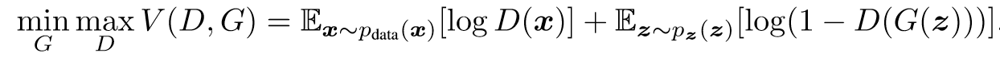
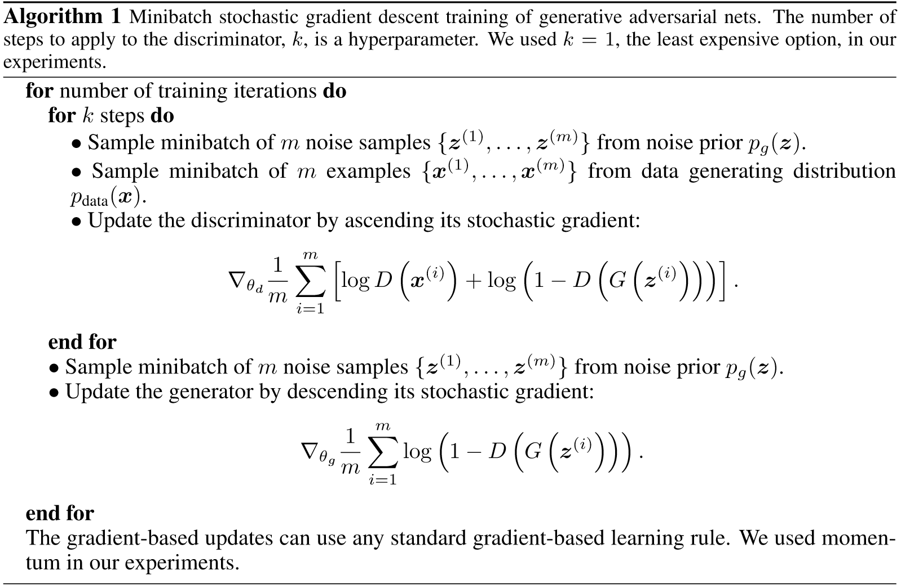
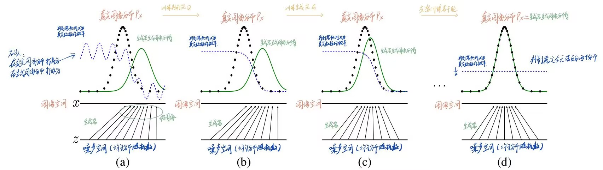
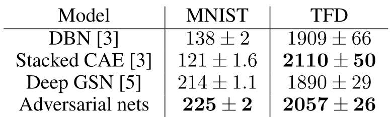
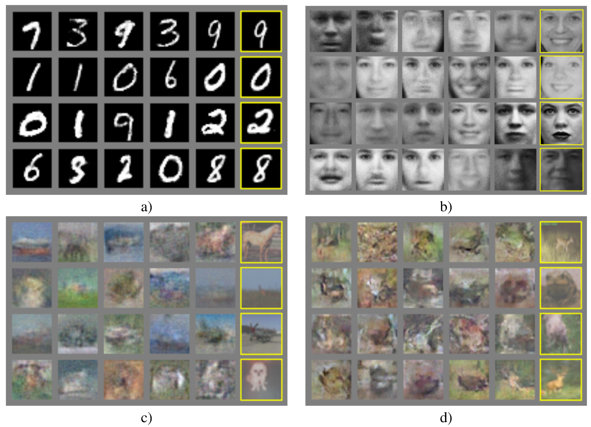

# 生成对抗网络

## 引用方式

### GB/T 7714

Goodfellow I, Pouget-Abadie J, Mirza M, et al. Generative adversarial networks[J]. Communications of the ACM, 2020, 63(11): 139-144.

### BibTex

    @article{goodfellow2020generative,
      title={Generative adversarial networks},
      author={Goodfellow, Ian and Pouget-Abadie, Jean and Mirza, Mehdi and Xu, Bing and Warde-Farley, David and Ozair, Sherjil and Courville, Aaron and Bengio, Yoshua},
      journal={Communications of the ACM},
      volume={63},
      number={11},
      pages={139--144},
      year={2020},
      publisher={ACM New York, NY, USA}
    }

## 开源代码

[eriklindernoren/PyTorch-GAN: PyTorch implementations of Generative Adversarial Networks. (github.com)](https://github.com/eriklindernoren/PyTorch-GAN)

## 主要思想

深度学习的前景是发现能表示人工智能应用中遇到的各种数据的概率分布的丰富的分层模型。到目前为止，深度学习中最引人注目的成功涉及判别模型（拟合条件概率分布 $p(y|x)$ ），而深度生成模型（拟合概率分布 $p(x,y)$ ）的影响较小。本文提出了一个新的框架，用于通过对抗过程来估计生成模型，其中同时训练两个模型：捕获数据分布的生成模型 $G$ 和估计样本来自训练数据而不是 $G$ 的概率的判别模型 $D$ 。在任意函数 $G$ 和 $D$ 的空间中，存在唯一的解，其中 $G$ 收敛于训练数据的分布， $D$ 处处等于 $\frac{1}{2}$ （ $D$ 无法分辨数据来自生成分布还是真实分布）。通过对生成的样本进行定性和定量评估，实验证明了该框架的潜力。

## 主要内容

### 对抗网络

\
(<a href="zotero://select/library/items/8H2Y6LJJ">Goodfellow 等</a>)

$z$ : 随机噪声; $p_z(z)$:随机噪声 $z$ 服从的概率分布

$G(z;\theta_g)$ : 生成器:输入 $z$ 输出假图像; $p_g$:生成器生成的假图像服从的概率分布

$x\sim p_{data}$ : 真实数据服从的概率分布

$D(x;\theta_d)$ : 判别器:输入图像，输出该图像是真实图像的概率 $\in [0,1]$

$\max_DV(D,G)$ :给定生成器 $G$，找到使 $V$ 最大化的判别器 $D$

等式右端第一项此时表示判别器输入真实数据时，输出越大越好；等式右端第二项与 $D(G(z))$ 成反比，此时生成器生成的假图越被判别器判定为假图。

$\min_G\max_DV(D,G)$ :给定判别器 $D$ ，找到使 $V$ 最小化的生成器 $G$

等式右端第二项此时表示生成器生成的假图越被误判为真图。

### 算法流程及训练技巧

\
(<a href="zotero://select/library/items/8H2Y6LJJ">Goodfellow 等</a>)

训练刚开始时，生成的图像太假，太容易被判别器识破。 $D(G(z))$ 接近0， $log(1-D(G(z))$ 饱和无梯度，变原来的最小化 $log(1-D(G(z))$ 为最大化 $log(D(G(z))$ 。

生成器网络使用RELU和Sigmoid激活函数的混合，而判别器网络使用maxout激活函数。在训练判别器网络时应用了Dropout。虽然我们的理论框架允许在生成器的中间层使用Dropout和其他噪声，但我们仅在生成器最底层使用噪声作为输入。

### 理论结果

*   固定生成器 $G$ ，最优判别器认为输入的 $x$ 为真实数据的概率(其中 $p_{data}(x)$ : $x$ 为真的概率;  $p_g(x)$ :x为假的概率)：

    $D_G^*(x)=\frac{p_{data}(x)}{p_{data}(x)+p_g(x)}$

*   当且仅当 $p_g=p_{data}$ ( $D_G^{\*}(x)=\frac{1}{2}$ ) 时训练准则 $C(G) [ \max_{D^*}V(G,D)]$ 达到  最小值 $-log4$ 。

*   如果生成器 $G$ 和判别器 $D$ 具有足够的capacity，并且在算法1的每个步骤中，对给定的生成器 $G$ ，判别器 $D$ 都可能达到最优，并且 $p_g$ 的更新是为了改进准则：

    $E_{\boldsymbol{x} \sim p_{data}}\left[\log D_G^{\*}(\boldsymbol{x})\right]+E_{\boldsymbol{x} \sim p_g}\left[\log \left(1-D_G^{\*}(\boldsymbol{x})\right)\right]$

那么 $p_g$ 收敛到 $p_{data}$ 。

## 结论及改进方向

### 实验结果

在一系列数据集上训练了对抗性网络，包括MNIST、多伦多人脸数据库（TFD）和CIFAR-10。

通过将一个Gaussian Parzen窗口拟合到 $G$ 生成的样本并报告在 $p_g$ 下的对数似然性，来估计测试集数据的概率。

\
(<a href="zotero://select/library/items/8H2Y6LJJ">Goodfellow 等</a>)

最右边的列显示了与邻居样本的最相似训练示例，以证明模型没有记住训练集。样品是随机抽取的，而不是精心挑选的。

\
(<a href="zotero://select/library/items/8H2Y6LJJ">Goodfellow 等</a>)

### 优缺点

#### 缺点

没有显式表示 $p_g$ 。

可能造成模式崩溃(model collapse): 生成器总是生成一样的图像。

#### 优点

生成器不是直接用原始数据训练，而是用判别器训练，这阻断了过拟合。

GAN可以表示非常尖锐甚至恶化、退化的分布。

### 未来研究

1.  条件GAN(CGAN)

2.  输入 $x$ 预测 $z$ （图像编辑）

3.  类似图像填充和超分辨率的工作

4.  半监督学习：用判别器特征辅助分类

## 概念名词

non-parametric limit: 概率分布拟合能力上限由数据量本身决定，而不是由模型参数（capacity）决定，只要数据量足够大，性能可以无限好，比如：KNN、dp-means、高斯过程（概率机器学习）。而自带先验分布假设的模型，如：线性回归、逻辑回归、支持向量机都不是non-parametric limit

KL散度： $KL(P||Q)=\mathbb{E}_{x\sim P}[ln\frac{P(x)}{Q(x)}]$
